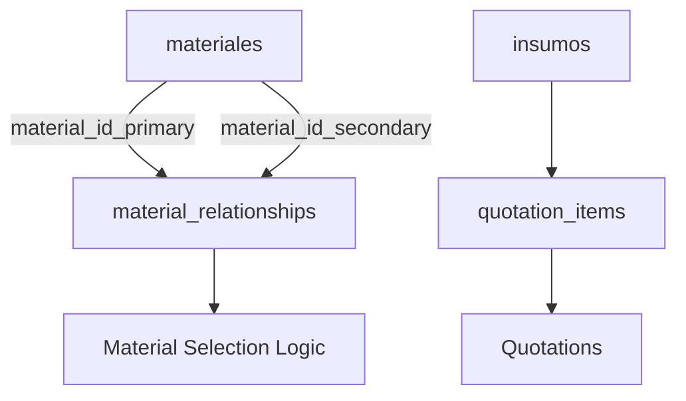

# Cucina Capitale - Database Design & Logic Documentation

## 📋 Project Overview

This document outlines the database architecture and business logic for the Cucina Capitale project, a kitchen design and quotation management system.

**Project**: Cucina Capitale  
**Database**: Supabase PostgreSQL  
**Project ID**: `hiancxskyeqqycvxuyms`  
**Last Updated**: December 2024

---

## 🗄️ Database Schema Overview

### Core Tables

#### 1. `insumos` (Products/Inventory)
**Purpose**: Main inventory table containing all kitchen products and components.

```sql
Table: insumos
├── id (SERIAL PRIMARY KEY)
├── mueble (VARCHAR) - Product category/type
├── descripcion (VARCHAR) - Product description
├── precio (DECIMAL) - Unit price
├── created_at (TIMESTAMP)
└── updated_at (TIMESTAMP)
```

**Data Stats**:
- **Total Records**: 99,014
- **Categories**: 26 distinct categories
- **Main Categories**: Alacena, Gabinete, Cajón, Closet, etc.

**Business Logic**:
- Used for product selection in quotations
- Searchable by category (`mueble`) and description (`descripcion`)
- Implements infinite scrolling for large datasets (20 items per page)

#### 2. `materiales` (Materials Catalog)
**Purpose**: Catalog of all materials used in kitchen construction.

```sql
Table: materiales
├── id_material (SERIAL PRIMARY KEY)
├── tipo (VARCHAR) - Material type
├── nombre (VARCHAR) - Material name
├── costo (DECIMAL) - Material cost
├── categoria (VARCHAR) - Material category
├── comentario (TEXT) - Additional notes
├── subcategoria (VARCHAR) - Material subcategory
├── created_at (TIMESTAMP)
└── updated_at (TIMESTAMP)
```

**Material Types**:
- **Tableros**: 546 records
- **Cubrecantos**: 1,076 records  
- **Correderas**: 63 records
- **Bisagras**: 9 records
- **Jaladeras**: 18 records

**Business Logic**:
- Materials are selected per quotation item
- Cost calculations based on material prices
- Categorized for efficient selection in UI

#### 3. `material_relationships` (Material Compatibility)
**Purpose**: Defines which materials are compatible with each other (e.g., which cubrecantos work with specific tableros).

```sql
Table: material_relationships
├── id (SERIAL PRIMARY KEY)
├── material_id_primary (INTEGER) - FK to materiales (primary material)
├── material_id_secondary (INTEGER) - FK to materiales (secondary material)
├── relationship_type (VARCHAR) - Type of relationship
├── notes (TEXT) - Additional relationship notes
├── created_at (TIMESTAMP)
└── updated_at (TIMESTAMP)
```

**Relationship Types**:
- `tablero_cubrecanto` - Tablero to Cubrecanto compatibility
- Future: `bisagra_puerta`, `corredera_cajon`, etc.

**Business Logic**:
- Ensures material compatibility in quotations
- Guides material selection process
- Prevents incompatible material combinations

---

## 🔗 Data Relationships

### Primary Relationships



### Foreign Key Constraints

1. **material_relationships.material_id_primary** → **materiales.id_material**
2. **material_relationships.material_id_secondary** → **materiales.id_material**

### Indexes for Performance

```sql
-- Material relationships indexes
CREATE INDEX idx_material_relationships_primary ON material_relationships(material_id_primary);
CREATE INDEX idx_material_relationships_secondary ON material_relationships(material_id_secondary);
CREATE INDEX idx_material_relationships_type ON material_relationships(relationship_type);

-- Insumos search optimization (recommended)
CREATE INDEX idx_insumos_mueble ON insumos(mueble);
CREATE INDEX idx_insumos_descripcion ON insumos USING gin(to_tsvector('spanish', descripcion));
```

---

## 🏗️ Business Logic & Rules

### Product Selection Workflow

1. **Category Selection**: User selects from 26 predefined categories
2. **Search Within Category**: Searches `descripcion` field within selected category
3. **Global Search**: If no category selected, searches `mueble` field (requires 2+ characters)
4. **Infinite Loading**: Results loaded in batches of 20 items
5. **Selection**: User selects product for quotation

### Material Selection Logic

1. **Material Type Selection**: User selects material type (Tableros, Cubrecantos, etc.)
2. **Compatibility Check**: System checks `material_relationships` for compatible materials
3. **Cost Calculation**: Material costs added to quotation total
4. **Validation**: Ensures all required materials are selected

### Data Integrity Rules

- **Unique Relationships**: Prevents duplicate material relationships
- **Cascade Deletes**: Material deletion removes associated relationships
- **Auto-increment IDs**: All tables use SERIAL primary keys
- **Timestamps**: Automatic creation and update timestamps

---

## 📊 Performance Considerations

### Large Dataset Handling

**Insumos Table (99K records)**:
- Implements pagination (20 items per page)
- Uses efficient LIMIT/OFFSET queries
- Category filtering reduces result sets
- Search indexing for fast text searches

**Materials Table (1.7K records)**:
- Smaller dataset, can load all at once
- Grouped by type for organized selection
- Cached material relationships for fast compatibility checks

### Query Optimization

```sql
-- Efficient product search within category
SELECT * FROM insumos 
WHERE mueble = $1 
AND descripcion ILIKE '%' || $2 || '%'
ORDER BY id 
LIMIT 20 OFFSET $3;

-- Material compatibility lookup
SELECT m.* FROM materiales m
JOIN material_relationships mr ON m.id_material = mr.material_id_secondary
WHERE mr.material_id_primary = $1 
AND mr.relationship_type = 'tablero_cubrecanto';
```

---

## 🔄 Migration History

### Applied Migrations

1. **`fix_materiales_auto_increment`** - Added auto-increment to materiales.id_material
2. **`create_material_relationships_table`** - Created material compatibility system
3. **`create_material_relationship_helper_function`** - Added helper function for bulk inserts

### Migration Scripts Location
```
sql/
├── connect_tables.sql
└── [future migration files]
```

---

## 🚀 Future Enhancements

### Planned Features

1. **Extended Relationships**:
   - Bisagra-Puerta compatibility
   - Corredera-Cajon relationships
   - Jaladera-Style mappings

2. **Advanced Search**:
   - Full-text search with PostgreSQL FTS
   - Fuzzy matching for material names
   - Search result ranking

3. **Performance Optimization**:
   - Materialized views for complex queries
   - Connection pooling optimization
   - Query result caching

4. **Data Management**:
   - Bulk import utilities
   - Data validation rules
   - Audit logging

---

## 🛠️ Developer Guidelines

### Adding New Material Types

1. Add new tipo to materiales table
2. Create relationship type in material_relationships
3. Update UI components to handle new type
4. Add validation rules

### Database Queries Best Practices

- Always use parameterized queries
- Implement proper pagination for large datasets
- Use transactions for multi-table operations
- Monitor query performance with EXPLAIN

### Data Import Process

1. **CSV Preparation**: Ensure proper column mapping
2. **Validation**: Check for required fields and data types
3. **Batch Processing**: Process large imports in chunks
4. **Error Handling**: Log and handle import errors gracefully

---

## 📞 Support & Maintenance

### Monitoring
- Query performance monitoring
- Storage usage tracking
- Connection pool monitoring

### Backup Strategy
- Automated daily backups via Supabase
- Point-in-time recovery available
- Regular backup testing

### Contact
For database-related questions or issues, refer to this documentation or check the project's issue tracker.

---

*This document is maintained alongside the codebase and should be updated with any database schema changes.* 